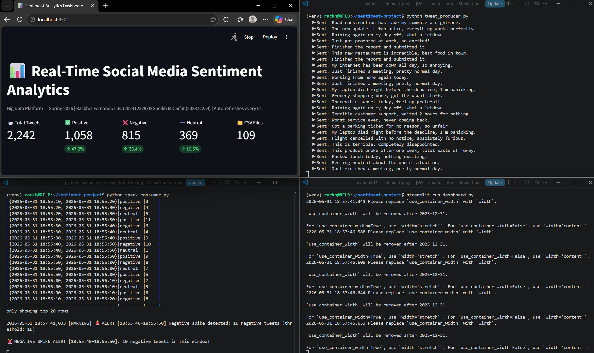
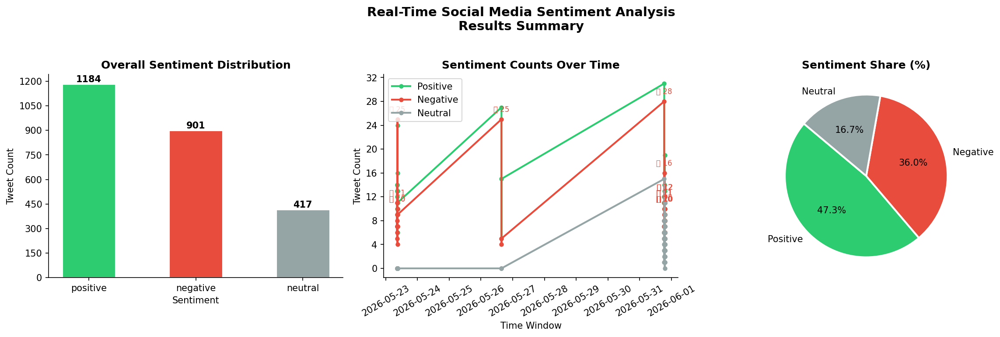
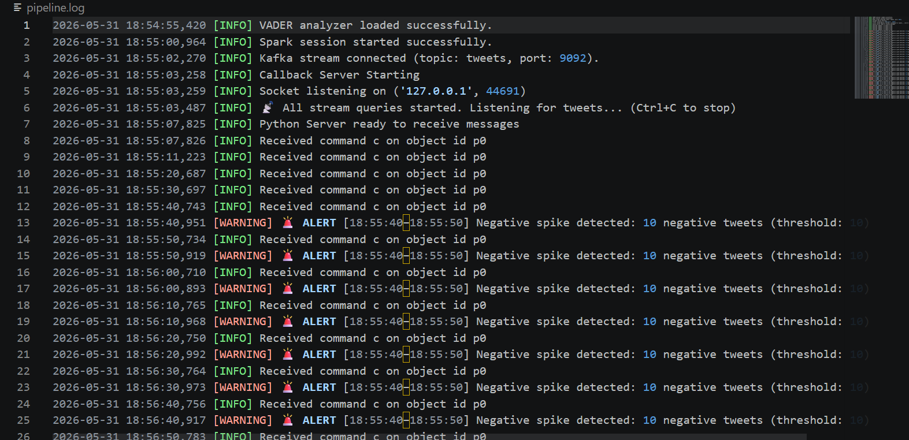

# Real-Time Social Media Sentiment Analytics System

**Student:** Rackhel Fernando L.B. & Sheikh MD Sifat
**Student ID:** 202312229 | 202312254
**Course:** Big Data Platform — Spring 2026

---

## Project Overview

A real-time streaming pipeline that simulates social media tweets,
classifies their sentiment using VADER, outputs windowed counts every
10 seconds, fires alerts on negative spikes, and displays a live
Streamlit dashboard — using Apache Kafka and Spark Structured Streaming.

---

## Architecture

```text
tweet_producer.py
│
▼
Apache Kafka (topic: tweets)
│
▼
Spark Structured Streaming
│
▼
VADER Sentiment UDF
│
├──▶ Console (windowed counts every 10s)
├──▶ Alert engine (🚨 if negative ≥ 5 in a window)
├──▶ pipeline.log (structured log file)
└──▶ CSV output (output/sentiment_results/)
         │
         ▼
    dashboard.py  ←  Streamlit live dashboard (auto-refreshes every 5s)
```

---

## Tools & Versions

| Tool | Version |
|---|---|
| Python | 3.11 |
| PySpark | 3.5.0 |
| Apache Kafka | confluentinc/cp-kafka:7.4.0 |
| Zookeeper | confluentinc/cp-zookeeper:7.4.0 |
| VADER Sentiment | 3.3.2 |
| Streamlit | ≥ 1.33 |
| Plotly | ≥ 5.0 |
| Java | 17 (openjdk) |
| OS | Ubuntu (WSL2 on Windows) |

---

## Setup Instructions

### 1. Prerequisites
- WSL2 with Ubuntu
- Docker Desktop (WSL2 backend enabled)
- VS Code with WSL extension

### 2. Install Java 17
```bash
sudo apt update && sudo apt install -y openjdk-17-jdk
export JAVA_HOME=/usr/lib/jvm/java-17-openjdk-amd64
echo 'export JAVA_HOME=/usr/lib/jvm/java-17-openjdk-amd64' >> ~/.bashrc
echo 'export PATH=$JAVA_HOME/bin:$PATH' >> ~/.bashrc
source ~/.bashrc
```

### 3. Create Python 3.11 virtual environment
```bash
python3.11 -m venv venv
source venv/bin/activate
pip install pyspark==3.5.0 kafka-python vaderSentiment streamlit plotly pandas
```

### 4. Start Kafka with Docker
```bash
docker compose up -d
```

### 5. Run the pipeline
Open **three** terminals:

**Terminal 1 — Producer:**
```bash
source venv/bin/activate
python tweet_producer.py
```

**Terminal 2 — Consumer (Spark):**
```bash
source venv/bin/activate
python spark_consumer.py
```

**Terminal 3 — Live Dashboard:**
```bash
source venv/bin/activate
streamlit run dashboard.py
```
Open http://localhost:8501 in your browser.

---

## Features

### Negative Spike Alerting
`spark_consumer.py` checks every 10-second window. If **10 or more**
negative tweets appear in a single window, it prints a `🚨 ALERT` to
the console and logs it to `pipeline.log`. Threshold is configurable
via `ALERT_THRESHOLD` at the top of the file.

### Error Handling & Logging
- All components wrapped in `try/except` with descriptive log messages.
- `pipeline.log` written alongside the script for post-run inspection.
- Malformed tweets return `"neutral"` with a warning log rather than
  crashing the stream.
- Bad CSV files in the dashboard are skipped gracefully.

### Balanced Tweet Pool
The producer draws from 80 tweets (30 positive / 30 negative / 20 neutral),
producing a realistic distribution rather than a fixed biased sample.

### Live Streamlit Dashboard
`dashboard.py` auto-refreshes every 5 seconds and shows:
- KPI metrics (total, positive %, negative %, neutral %)
- 🚨 Alert banner when a negative spike is detected
- Bar chart + donut chart (overall distribution)
- Time-series line chart (per-window counts)
- Scrollable recent tweets table

---

## Errors Encountered & Solutions

### Error 1: Wrong Java version
**Problem:** PySpark 3.5.0 requires Java 11 or 17. Initial install had
Java 11 but JAVA_HOME was empty so Spark couldn't find it.
**Solution:** Switched to Java 17, set JAVA_HOME permanently in ~/.bashrc.

### Error 2: Python 3.14 serialization error
**Problem:** UDF failed with `RecursionError: Stack overflow` during
pickle serialization. PySpark is not yet compatible with Python 3.14.
**Error message:** `_pickle.PicklingError: Could not serialize object`
**Solution:** Created a new venv using Python 3.11 which is fully
compatible with PySpark 3.5.0.

### Error 3: Streamlit duplicate auto-generated element ID
**Problem:** Dashboard crashed on the second refresh cycle with
`StreamlitDuplicateElementId`. Streamlit auto-generates element IDs
based on chart parameters, and `plotly_chart` calls with identical
parameters collided across refresh iterations.
**Error message:** `streamlit.errors.StreamlitDuplicateElementId: There are multiple plotly_chart elements with the same auto-generated ID.`
**Solution:** Added unique `key=` arguments (`key="bar_chart"`, etc.)
to each `st.plotly_chart()` call.

### Error 4: Streamlit duplicate element key
**Problem:** Adding static string keys (e.g. `key="bar_chart"`) caused
a new crash — `StreamlitDuplicateElementKey`. The root cause was the
`while True` loop inside the script: Streamlit executes the full script
in a single run, so each loop iteration re-registered the same key
within the same execution, making them duplicates even with unique names.
**Error message:** `streamlit.errors.StreamlitDuplicateElementKey: There are multiple elements with the same key='bar_chart'.`
**Solution:** Removed the `while True` loop entirely and replaced it
with `time.sleep(5)` followed by `st.rerun()` at the end of the script.
Streamlit triggers a fresh execution, all element IDs reset cleanly,
and no `key=` arguments are needed.

### Warning: KAFKA-1894
**Message:** `KafkaDataConsumer is not running in UninterruptibleThread`
**Solution:** Known harmless warning in Spark's Kafka connector. Log
level set to ERROR to suppress. Does not affect pipeline results.

---

## Output

### Console output (every 10 seconds)
```text
+------------------------------------------+---------+-----+
|window                                    |sentiment|count|
+------------------------------------------+---------+-----+
|{2026-05-23 08:34:00, 2026-05-23 08:34:10}|negative |8    |
|{2026-05-23 08:34:00, 2026-05-23 08:34:10}|positive |12   |
+------------------------------------------+---------+-----+

🚨 NEGATIVE SPIKE ALERT [08:34:00–08:34:10]: 8 negative tweets in this window!
```

### CSV output
Raw tweet-level records saved to `output/sentiment_results/`
with columns: tweet, timestamp, sentiment.


### Live Dashboard
Streamlit dashboard at http://localhost:8501 — auto-refreshes every 5s.



### Visualization
Static chart from visualize.py, `output/sentiment_chart.png`. 



### Log file
Structured log at `pipeline.log` — INFO/WARNING/ERROR entries for
every pipeline event, including all spike alerts.



---

## File Structure

```text
sentiment-project/
├── venv/                    # Python virtual environment
├── docker-compose.yml       # Kafka + Zookeeper containers
├── tweet_producer.py        # Simulates tweets → Kafka (80-tweet pool)
├── spark_consumer.py        # Spark stream → VADER → output + alerts
├── dashboard.py             # Streamlit live dashboard
├── visualize.py             # Static post-hoc chart (3 charts → PNG)
├── pipeline.log             # Structured log (generated at runtime)
└── output/
    ├── sentiment_results/   # CSV output files
    ├── checkpoint/          # Spark streaming checkpoint
    └── sentiment_chart.png  # Static chart from visualize.py
```