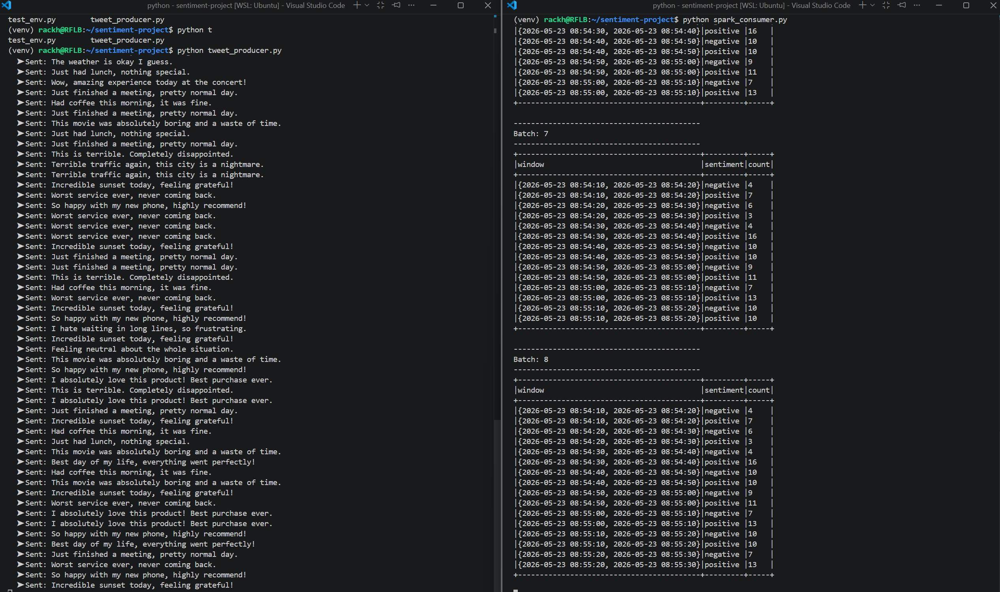
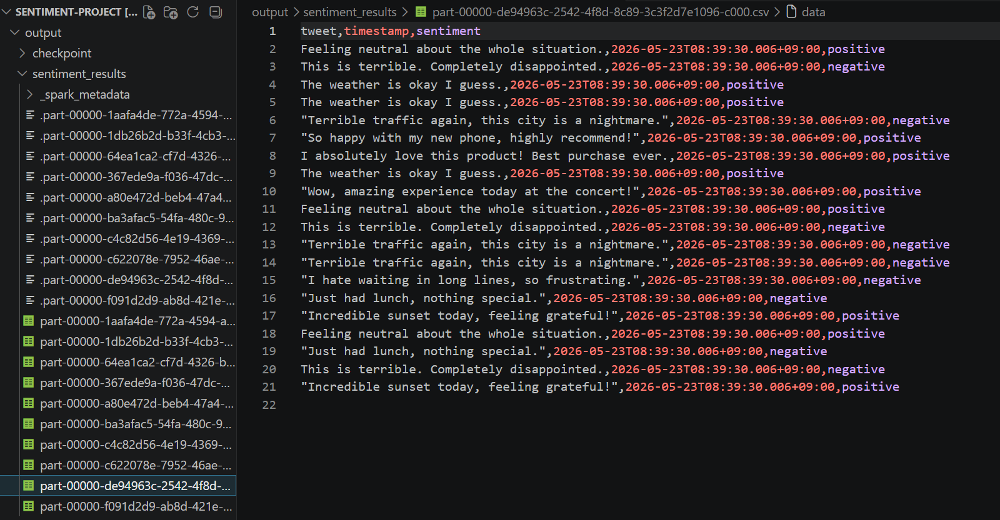

# Real-Time Social Media Sentiment Analytics System

**Student:** Rackhel Fernando L.B.
**Student ID:** 202312229
**Course:** Big Data Platform — Spring 2026

---

## Project Overview

A real-time streaming pipeline that simulates social media tweets,
classifies their sentiment using VADER, and outputs windowed counts
every 10 seconds using Apache Kafka and Spark Structured Streaming.

---
## Architecture

```text
tweet_producer.py
│
▼
Apache Kafka (topic: tweets)
│
▼
Spark Structured Streaming
│
▼
VADER Sentiment UDF
│
├──▶ Console (windowed counts every 10s)
└──▶ CSV output (output/sentiment_results/)
```

---

## Tools & Versions

| Tool | Version |
|---|---|
| Python | 3.11 |
| PySpark | 3.5.0 |
| Apache Kafka | confluentinc/cp-kafka:7.4.0 |
| Zookeeper | confluentinc/cp-zookeeper:7.4.0 |
| VADER Sentiment | 3.3.2 |
| Java | 17 (openjdk) |
| OS | Ubuntu (WSL2 on Windows) |

---

## Setup Instructions

### 1. Prerequisites
- WSL2 with Ubuntu
- Docker Desktop (WSL2 backend enabled)
- VS Code with WSL extension

### 2. Install Java 17
```bash
sudo apt update && sudo apt install -y openjdk-17-jdk
export JAVA_HOME=/usr/lib/jvm/java-17-openjdk-amd64
echo 'export JAVA_HOME=/usr/lib/jvm/java-17-openjdk-amd64' >> ~/.bashrc
echo 'export PATH=$JAVA_HOME/bin:$PATH' >> ~/.bashrc
source ~/.bashrc
```

### 3. Create Python 3.11 virtual environment
```bash
python3.11 -m venv venv
source venv/bin/activate
pip install pyspark==3.5.0 kafka-python vaderSentiment
```

### 4. Start Kafka with Docker
```bash
docker compose up -d
```

### 5. Run the pipeline
Open two terminals:

**Terminal 1 — Producer:**
```bash
source venv/bin/activate
python tweet_producer.py
```

**Terminal 2 — Consumer:**
```bash
source venv/bin/activate
python spark_consumer.py
```

---

## Errors Encountered & Solutions

### Error 1: Wrong Java version
**Problem:** PySpark 3.5.0 requires Java 11 or 17. Initial install had
Java 11 but JAVA_HOME was empty so Spark couldn't find it.
**Solution:** Switched to Java 17, set JAVA_HOME permanently in ~/.bashrc.

### Error 2: Python 3.14 serialization error
**Problem:** UDF failed with `RecursionError: Stack overflow` during
pickle serialization. PySpark is not yet compatible with Python 3.14.
**Error message:** `_pickle.PicklingError: Could not serialize object`
**Solution:** Created a new venv using Python 3.11 which is fully
compatible with PySpark 3.5.0.

### Warning: KAFKA-1894
**Message:** `KafkaDataConsumer is not running in UninterruptibleThread`
**Solution:** This is a known harmless warning in Spark's Kafka
connector. No action needed — does not affect pipeline results.

---

## Output

### Console output (every 10 seconds)
```text
+------------------------------------------+---------+-----+
|window                                    |sentiment|count|
+------------------------------------------+---------+-----+
|{2026-05-23 08:34:00, 2026-05-23 08:34:10}|negative |8    |
|{2026-05-23 08:34:00, 2026-05-23 08:34:10}|positive |12   |
+------------------------------------------+---------+-----+
```



### CSV output
Raw tweet-level records saved to `output/sentiment_results/`
with columns: tweet, timestamp, sentiment.



### Visualization


---

## File Structure

```text
sentiment-project/
├── venv/                    # Python virtual environment
├── docker-compose.yml       # Kafka + Zookeeper containers
├── tweet_producer.py        # Simulates tweets → Kafka
├── spark_consumer.py        # Spark stream → VADER → output
├── output/
│   ├── sentiment_results/   # CSV output files
│   └── checkpoint/          # Spark streaming checkpoint
└── README.md
```
